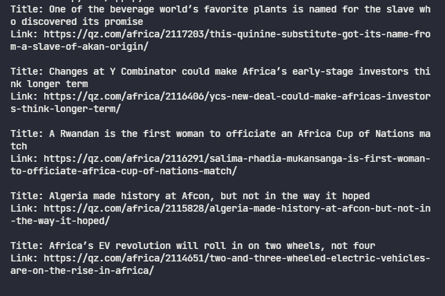

<h1 align="center">Magroove Tech Test Python</h1>
<h3 align="center">Web Scrapping</h3>


<p align="center">
  
</p>

## 💻 Project
Simple web scrapping of the Quartz Africa [articles](https://qz.com/africa/latest/) for the Magroove [challenge](./magroove-test-python.txt).

## 🚀 Technologies
This project was developed with the following technologies:

- Python 3
- Beautiful Soup lib
- Requests lib

## 🏃 Running
To run this project you'll need:
- Python 3.9.5
- Terminal (like Git Bash)

After cloning/downloading the project, install the dependencies:
```
pip install beautifulsoup4
pip install requests

```
Then, run the app with:
```
python app.py

```